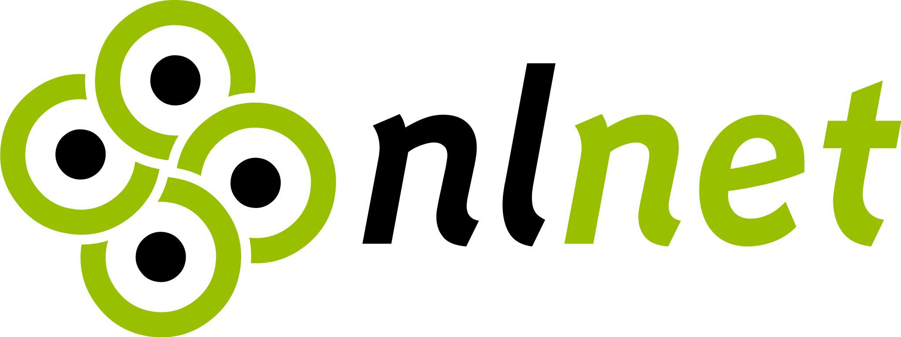

# Darkstar


Darkstar is a multi-tenant vulnerability management and attack-surface platform
for external ASM, DAST, network vulnerability scanning, endpoint inventory,
internal network mapping, reporting, and Sec/DevOps integration.

The project is under active development. Expect fast-moving features and keep
production deployments behind normal change control, backups, and access
management.

## Responsible Use

Darkstar contains security tooling that can scan networks, web applications and
endpoints. Use it only on systems where you have explicit authorization. You are
responsible for configuring scope, intensity, credentials, retention, exports,
and disclosure workflows correctly. Do not use Darkstar for unauthorized access,
harassment, disruption, data theft, or any other illegal activity.

## Features

- Multi-tenant web dashboard with per-organization data separation.
- ASM workflows for external attack-surface mapping and discovery.
- DAST and vulnerability checks using tools such as Nuclei, OWASP ZAP, Nikto,
  Wapiti, OpenVAS/Greenbone and supporting scanners.
- Distributed scanner workers for scanning from internal networks or separate
  scanner nodes.
- Endpoint inventory agents for Debian/Linux and Windows.
- Internal endpoint network mapping from routes, neighbors, gateways and peer
  reachability checks.
- Vulnerability enrichment, CVE/OSV/vendor matching, KEV/EPSS context and
  grouped reporting.
- MFA, OIDC SSO, role-based access, API keys and notification settings.
- HTML/PDF style report views plus CSV/XLSX style exports where supported.
- Application documentation available in the repository and in-app at
  `/documentation`.
- Unit, smoke, Playwright, dependency and security test coverage for CI/CD.

## Supported By

Darkstar is supported by [SIDN](https://www.sidnfonds.nl/) and
[NLnet](https://nlnet.nl/).




## Requirements

Required for the main stack:

- Docker
- Docker Compose
- Git

Useful for local development:

- Python 3.11+
- Playwright Chromium for browser tests
- Go 1.23+ for the native Windows endpoint agent

Optional runtime tooling depends on enabled scan modes and endpoint agents. See
[application documentation](./docs/application-documentation.md) for the tool
and license overview.

## Quick Start

```bash
git clone --recurse-submodules git@github.com:The-DarkStar-Project/darkstar.git
cd darkstar
chmod +x run.sh
./run.sh
```

Or start the Docker Compose stack directly:

```bash
docker compose --profile darkstar up -d --build
```

Open the dashboard:

```text
http://localhost:8080
```

On first login, Darkstar creates the tenant database for the organization. Later
logins use the stored organization account and configured auth policy.

## Documentation

- In-app documentation: `http://localhost:8080/documentation`
- [Application documentation](./docs/application-documentation.md)
- [Testing guide](./docs/testing.md)
- [Security testing and Sec/DevOps pipeline](./docs/security-testing-pipeline.md)
- [Distributed scanner workers](./docs/distributed-scanners.md)
- [Debian endpoint agent](./agents/darkstar-debian-agent/README.md)
- [Windows endpoint agent](./agents/darkstar-windows-agent/README.md)

## Endpoint Agents

Endpoint agents submit OS, package, software, IP/MAC and internal-network
observations to Darkstar. Darkstar then matches inventory against OSV and vendor
vulnerability sources.

### Debian/Linux

Create an endpoint enrollment token in the Darkstar `Endpoints` view, then run
the generated command on the endpoint. The installer is also available directly:

```bash
curl -fsSLo /tmp/darkstar-endpoint-install.sh \
  https://raw.githubusercontent.com/The-DarkStar-Project/darkstar/main/agents/darkstar-debian-agent/install.sh
sudo bash /tmp/darkstar-endpoint-install.sh \
  --url "https://darkstar.example" \
  --org "org_example" \
  --enrollment-token "<endpoint enrollment token>"
```

This installs `darkstar-endpoint-agent.service`, writes protected config under
`/etc/darkstar/endpoint-agent.env`, and stores agent state under
`/var/lib/darkstar-endpoint/agent.json`.

### Windows

The native Windows agent lives in
[agents/darkstar-windows-agent](./agents/darkstar-windows-agent/README.md). It
builds as a single executable and runs as a Windows Service.

```bash
cd agents/darkstar-windows-agent
GOOS=windows GOARCH=amd64 go build -trimpath -ldflags="-s -w" -o dist/darkstar-agent.exe .
```

## Distributed Scanner Workers

Scanner workers let Darkstar run scans from internal networks or isolated worker
hosts while keeping orchestration centralized.

Create a scanner node from the orchestrator host:

```bash
docker compose exec darkstar-web python3 -m darkstar.scanner_attach create \
  --name internal-worker \
  --url http://darkstar.local:8080
```

The attach command writes scanner secrets to a `0600` env file and prints a
`docker run --env-file ...` command. See
[distributed scanner workers](./docs/distributed-scanners.md) for details.

## Testing

Install development dependencies:

```bash
python3 -m pip install -r requirements-dev.txt
```

Run unit and smoke tests:

```bash
python3 -m pytest -m "not playwright"
```

Run browser tests:

```bash
python3 -m playwright install chromium
RUN_PLAYWRIGHT=1 python3 -m pytest -m playwright
```

Run dependency and high-severity security checks:

```bash
python3 -m pip_audit -r requirements.txt
python3 -m pip_audit -r requirements-dev.txt
python3 -m bandit -q -lll darkstar
```

More detail is in [docs/testing.md](./docs/testing.md).

## Sec/DevOps Pipeline

Darkstar is designed to fit into a Sec/DevOps pipeline:

- unit and contract tests for core application behavior
- smoke tests for web/API boundaries
- Playwright tests for dashboard and documentation workflows
- dependency scanning with Dependabot/pip-audit
- SAST through CodeQL and optional Semgrep/Bandit
- DAST in staging with ZAP/Nuclei/Nikto/Wapiti
- Darkstar API-driven scans and report exports

See [security-testing-pipeline.md](./docs/security-testing-pipeline.md) for a
pipeline layout, examples, and operational rules.

## Repository Layout

```text
darkstar/                         Python application, scanners and web UI
darkstar/tests/                   Unit, smoke and Playwright tests
agents/darkstar-debian-agent/     Debian/Linux systemd endpoint agent installer
agents/darkstar-windows-agent/    Native Windows endpoint agent
docs/                             Application, testing and security docs
migrations/                       SQL migration files
openvas_api/                      OpenVAS integration service
```

## Roadmap

- Broader endpoint agent packaging and fleet rollout support.
- More internal network map views and risk scoring.
- Deeper vulnerability enrichment and remediation workflows.
- More scanner orchestration controls for distributed environments.
- Expanded CI/CD examples for GitHub Actions and other platforms.

## License

Darkstar is licensed under the GNU GPLv3 License. See [LICENSE](./LICENSE) for
details. Third-party tools used with Darkstar have their own licenses; the
current overview is maintained in
[application-documentation.md](./docs/application-documentation.md).
