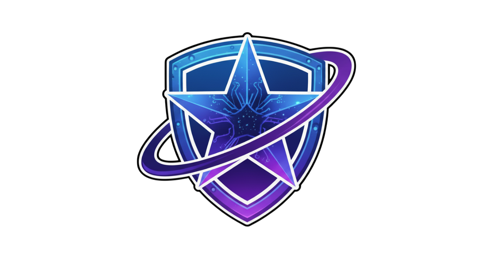

# Darkstar

## Vulnerability Management Solution
Darkstar is a very extensive Vulnerability Management solution. Which offers a variety of features which currently are being developed.

## Pre-requirements
Please install the following tools before using this project:
- Docker: https://docs.docker.com/get-docker/
- Docker Compose: https://docs.docker.com/compose/install/

## Installation
Follow these steps to correctly setup the Darkstar infrastructure:

1. `git clone --recurse-submodules git@github.com:The-DarkStar-Project/darkstar.git`
2. `cd darkstar`
3. `chmod +x run.sh && ./run.sh`

## Web Dashboard
Darkstar includes a web dashboard where each organization logs in with its own credentials.

- On first login, a dedicated tenant database is created automatically.
- On later logins, credentials are verified against the stored organization account.
- You can start scans from the UI and monitor recent findings and scan status.

Docker Compose:

1. Start stack: `docker compose --profile darkstar up -d --build`
2. Open dashboard: `http://localhost:8080`

## Roadmap
- Agent based vulnerability scanning
    - Internal Network Mapping
- Frontend with dashboard
- Vulnerability enhancement
- Orchestration

## Supported by:
We are very proud to be supported by [SIDN](https://www.sidnfonds.nl/) 

## License
This project is licensed under the GNU GPLv3 License. See the [LICENSE](./LICENSE) file for details.

